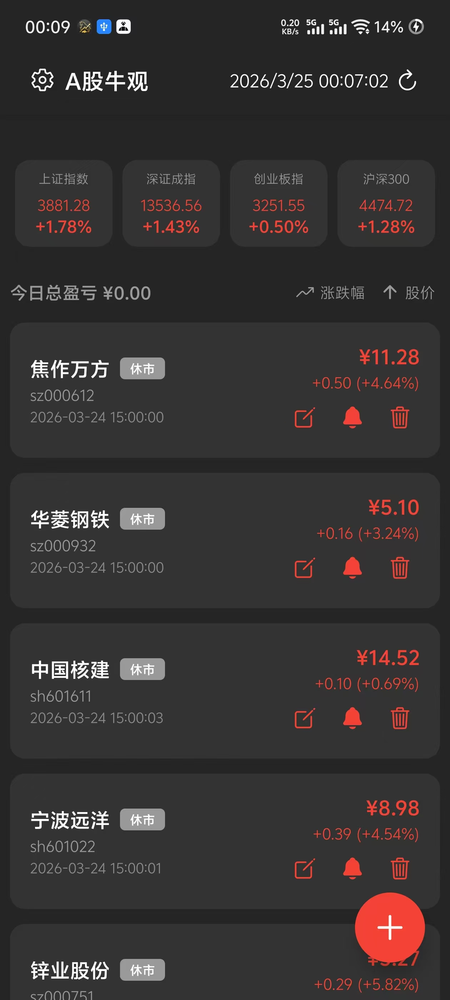
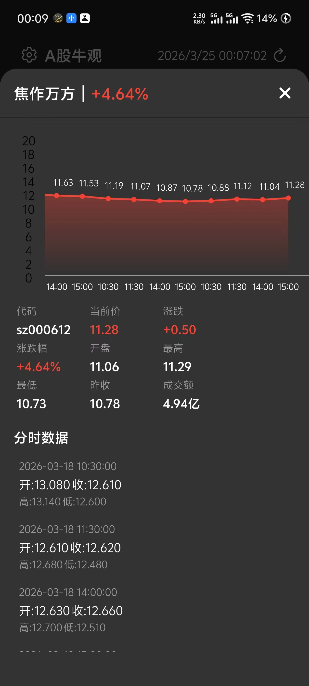
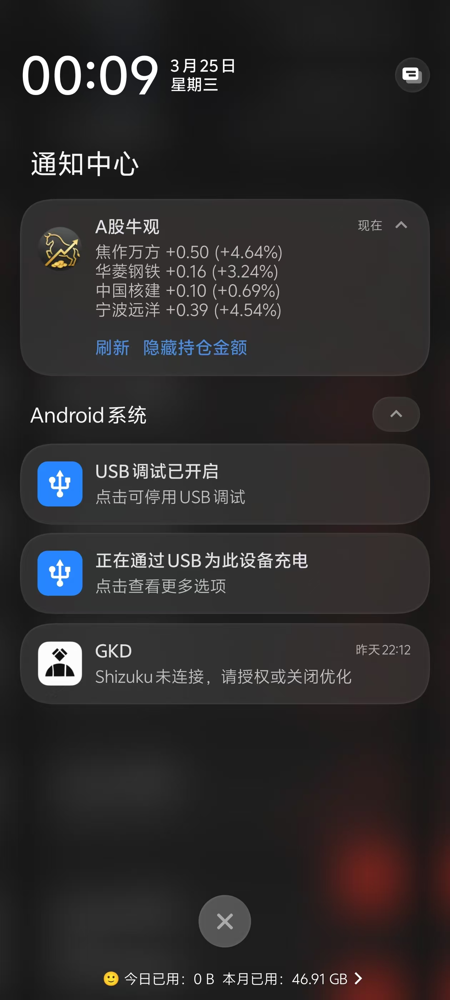

# A股牛观


一个简洁、高效的A股股票行情查看应用，**支持在状态栏实时查看股票行情**，无需打开应用即可掌握市场动态。

## 功能特性

- 📈 **实时股票行情**：查看最新股票价格、涨跌幅等数据
- 📊 **市场指数**：显示上证指数、深证成指等主要市场指数
- 💰 **持仓管理**：记录股票成本价和持仓数量，自动计算盈亏
- 🔔 **状态栏实时通知**：**在状态栏常驻显示股票行情**，支持后台自动刷新，无需打开应用即可查看
- ⏰ **定时刷新**：可设置自动刷新时间间隔
- 📱 **响应式设计**：适配不同屏幕尺寸的设备
- 🎨 **美观界面**：现代化的UI设计，支持深色模式

## 技术栈

- **前端框架**：React Native + Expo
- **状态管理**：React Hooks
- **路由**：Expo Router
- **数据存储**：AsyncStorage
- **网络请求**：Axios
- **图表**：react-native-gifted-charts
- **通知**：Expo Notifications
- **后台任务**：Expo Task Manager

## 项目截图

### 主界面



### 股票详情



### 后台通知



## 安装与运行

### 前提条件

- Node.js 16+ 
- npm 或 yarn
- Expo CLI

### 安装步骤

1. 克隆项目
   ```bash
   git clone https://github.com/2winter-dev/aglook.git
   cd aglook
   ```

2. 安装依赖
   ```bash
   npm install
   # 或
   yarn
   ```

3. 移除 app.json 中的项目 ID 和所有人信息
   - 打开 `app.json` 文件
   - 删除或修改 `expo.id` 和 `expo.owner` 字段

4. 运行项目
   ```bash
   # 启动开发服务器
   npm start
   
   # 在iOS模拟器运行
   npm run ios
   
   # 在Android模拟器运行
   npm run android
   
   # 在Web浏览器运行
   npm run web
   ```

## 使用说明

### 添加股票
1. 点击右下角的加号按钮
2. 在搜索框中输入股票代码或名称
3. 点击搜索结果添加股票

### 管理持仓
1. 点击股票卡片右侧的编辑按钮
2. 输入成本价和持仓数量
3. 点击保存，系统会自动计算盈亏

### 设置刷新时间
1. 点击顶部左侧的设置按钮
2. 选择合适的刷新时间间隔
3. 系统会按照设置的间隔自动刷新数据

### 后台通知
1. 在股票列表中，点击股票卡片右侧的通知按钮
2. 最多可选择4个股票显示在通知栏
3. 通知栏会显示股票的最新价格、涨跌幅和盈亏信息
4. 点击通知栏的刷新按钮可以手动刷新数据
5. 点击隐藏持仓金额按钮可以隐藏盈亏信息

## 项目结构

```
aglook/
├── app/             # 应用主目录
│   ├── _layout.tsx  # 应用布局
│   └── index.tsx    # 主页面
├── components/      # 组件目录
│   ├── modals/      # 模态框组件
│   └── StockItem.tsx # 股票项组件
├── constants/       # 常量定义
│   ├── index.style.ts # 样式定义
│   └── theme.ts     # 主题配置
├── hooks/           # 自定义钩子
├── services/        # 服务层
│   ├── stockService.ts    # 股票数据服务
│   ├── notificationService.ts # 通知服务
│   ├── backgroundService.ts # 后台服务
│   └── storageService.ts  # 存储服务
├── utils/           # 工具函数
├── assets/          # 静态资源
└── package.json     # 项目配置
```

## 数据来源

- 股票行情数据：新浪财经API
- 市场指数数据：新浪财经API

## 贡献指南

1. Fork 本仓库
2. 创建 feature 分支
3. 提交更改
4. 推送到分支
5. 开启 Pull Request

## 开发规范

- 代码风格：遵循 ESLint 规范
- 命名约定：使用驼峰命名法
- 提交信息：使用语义化提交信息
- 分支管理：使用 feature/ 前缀创建功能分支

## 许可证

MIT License

## 作者

2winter-dev

---

**A股牛观** - 状态栏查看股票行情，实时掌握市场动态！